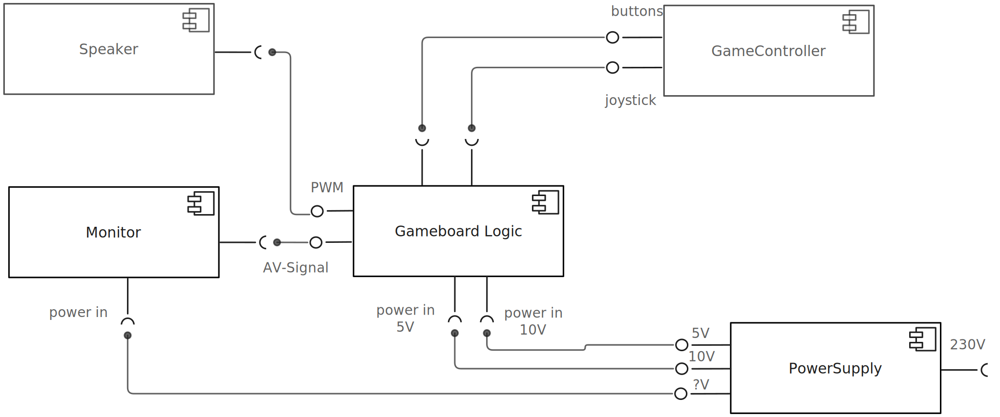

# SysML

# Homework: From UML to SysML
**Topic:** Understanding SysML through comparison with UML  
**Due:** Nov. 19, 2025  
**Submission:** A single pull request with all your contributions.

---

## Part 1: Conceptual Questions

Answer briefly

1. **Purpose and Motivation**  
   Why was SysML created? What limitations of UML does it address?

> SysML was created because UML is too software-centric. SysML is more of a general purpose modelling language and fills the gaps when you need to model hardware, mechanics, energy flows, sensors, and cross-disciplinary systems.

3. **Modeling Perspective**  
   UML is based on object-oriented concepts, especially the UML Class diagram. How does SysML’s *block-based* approach differ conceptually from UML’s *class-based* approach?

> UML classes are tied to object-oriented software concepts. SysML blocks are neutral — they can represent any system element (hardware, software, physical, logical) without OO constraints. While classes consist of `fields`, `methods` and `references`, blocks consist of `properties`, `references`/`values` and `ports`.

5. **Scope**  
   What kinds of system elements can be represented in SysML that are not typically modeled in UML?

> SysML can model things UML usually can’t: `hardware components`, `physical connections`, `energy/material flows`, `requirements`, `tests`, `parameters`, `ports`.

6. **Focus**  
   Give an example (maybe from your own experiences as a developer/student?) of a system where using UML alone would be insufficient, and explain how SysML can better represent it.

>Take something like an ESP32-based measurement system (like the one I built in Mechatronics). UML can show the software, but not the sensors, signals, power paths, or requirements. SysML combines all of that — hardware + logic + behavior + requirements — in one consistent model.

>For example if I want to develop an autonomous drone, I couldn’t make a UML diagram because I wouldn't have blocks like the physical components, the analysis of the parametrics, the physical quantities. This couldn't be modeled with UML, because it is more for a software example, and the architecture of the model wouldn't be enough.
---

## Part 2: Diagrams

1. Make a **comparison table** comparing UML diagrams and SysML diagrams.  
   - Indicate whether each is *reused*, *modified*, or *new* in SysML.  
   - For each SysML-specific diagram, write one short sentence about its purpose.

> | UML Diagram           | SysML Status  | SysML Equivalent / New Diagram        | Purpose (1 sentence)                                        |
> |----------------------|---------------|--------------------------------------|------------------------------------------------------------|
> | Class Diagram         | Modified      | Block Definition Diagram (BDD)        | Defines system elements (blocks), their structure, and relationships. |
> | Object Diagram        | Modified      | Block Definition Diagrams (BDD)        | Shows a snapshot of the objects/instances in a system at a specific point in time. |
> | Composite Structure   | Modified      | Internal Block Diagram (IBD)          | Shows internal parts of a block and how they interact via ports/flows. |
> | Package Diagram       | Reused        | Package Diagram                        | Organize model elements.                                    |
> | Use Case              | Reused        | Use Case Diagram                        | Capture system-level functions and interactions with actors. |
> | Activity Diagram      | Reused        | Activity Diagram                        | Describe workflows and behaviors.                           |
> | Sequence Diagram      | Reused        | Sequence Diagram                        | Describe interactions over time.                            |
> | State Machine         | Reused        | State Machine Diagram                   | Describe states and transitions of components.             |
> | Timing Diagram        | Reused        | Timing Diagram                           | Show time-based behavior of components.                    |
> | Interaction Overview  | Reused        | Interaction Overview                     | High-level view of interaction logic.                      |
> | Deployment Diagram    | Not included  | —                                       | UML-specific; SysML doesn’t use it.                        |
> 
> ### SysML-Only Diagrams
> 
> | SysML Diagram          | Type | Purpose (1 sentence)                                        |
> |------------------------|------|------------------------------------------------------------|
> | Requirements Diagram   | New  | Captures and links system requirements to design elements. |
> | Parametric Diagram     | New  | Expresses mathematical constraints for analysis and engineering calculations. |
> | Allocation Diagram     | New  | Shows relationships like “allocate function → hardware/software.” |

---

2. Explain briefly:
   - What is the **Block Definition Diagram (BDD)**?  
   - What are the main differences to the UML **Class Diagram**?

> - **Definition:** Defines the building blocks of a system (hardware, software, physical parts), their properties, interfaces, and relationships (structure).  
> - **Differences to UML Class Diagram:**  
>   - Not tied to object-oriented concepts (no methods, visibility, inheritance semantics).  
>   - Represents *any* system element, not just software classes.  
>   - Supports physical flows, ports, and engineering properties.  
>   - More flexible: blocks describe structure without OO rules.

3. What is a **Parametric Diagram** in SysML?  
   How does it enhance system analysis compared to UML?

> - **Definition:** Models **mathematical constraints** between system variables (e.g., forces, voltages, efficiencies) and explains how system parameters relate to each other.  
> - **Advantage over UML:** UML cannot express engineering equations; SysML parametrics allow analysis of performance, energy, stress, cost, failure probability, power budgets, thermal loads, etc., directly linked to system architecture.

---

## Part 3: Examples

1. Create a BDD diagram focusing on the hardware components of a [Tetris Cabinet](https://www.arcade-museum.com/Videogame/tetris) (try to think of everyting).

2. Create a UML Component diagram for the same [Tetris Cabinet](https://www.arcade-museum.com/Videogame/tetris).

---
